
Standard Operating Procedures


<!--more-->


 GNU FDL



 v1.5 Web



 May 2026


Primarily Written by Jeongwoo "Ryan" Kim  
with the help of Jerry Jiang.

## License
This document is licensed under the GNU Free Documentation License (GNU FDL).  
Copyright © 2025-2026 Jeongwoo Kim, Jerry Jiang.

## Legal
**Read the manual.**  
**Understand the manual.**  

**ANY misoperation caused by the future operators of the Audio System and anything related will not be the legal and financial responsibility of the writer of this manual.**  

**This manual comes with absolutely NO warranty.**  

**THE SOUND SYSTEM, UPON DISTRICT LEAVE OF THE WRITERS OF THIS MANUAL, WILL NO LONGER BE THE LEGAL RESPONSIBILITY OF THE WRITERS.**  

**ALL INFORMATION REGARDING FREE SERVICE BY THE WRITERS OF THIS MANUAL IS NON BINDING AND IS NOT A LEGAL GUARANTEE.**  

## Warnings
During operation of the sound system, it is possible you will be exposed to electrical wiring that can cause damage to equipment (oftentimes catastrophic), and injuries (possibly death) to the operator.

During the operation of the system follow all instructions, warnings, precautions, and notes supplied.

Throughout the course of this manual, the following symbols and supplied text will be used:

⚠ WARNING indicates any possible hazardous situation where catastrophic damage to equipment and the operator is possible. If this warning is not followed, fatalities and complete destruction of equipment is possible and sometimes likely.

⚠ CAUTION indicates any possible hazardous situation where small amounts of equipment damage could occur.

⚠ NOTE indicates any non-hazardous situation where if done improperly or incorrectly could result in a hazardous situation.

**FOLLOW ALL STEPS AND REGULATIONS OF THIS MANUAL. ANY IMPROPERLY DONE STEPS MAY RESULT IN HAZARDOUS CONDITIONS.**

## Modifications
Any modification should be carefully considered for compatibility with the existing hardware.

## Service
Service of the Audio System will be done free of charge by Ryan Kim, until 2030, if available. Contact Ryan via the [contact](/hardware/cmssound/contact) page.

## Components
### Master System
* Rane HAL2 Multiprocessor https://www.ranecommercial.com/legacy/hal/hal2.html
* Crest Audio Pro 7200 Amplifier https://peaveycommercialaudio.com/product/pro-7200/

### Mixer Subsystem
* Soundcraft EPM12 Mixer https://www.soundcraft.com/en-US/products/epm12

### Mic System
* Audio-Technica System 10 (ATW-1101/H92) https://www.audio-technica.com/en-us/microphones/wireless-systems/line-series/system-10/shop-systems/atw-1101-h92

## Technical References
### Cable Naming Format
**`Cable Type, #, Male[M]/Female[F], Length in ft.`** 
i.e. `XLR3F20` for a `XLR` cable, `#3`, `Female` end, `20 ft`

“\*” States any cable that follows the other parameters is usable. 
i.e. For a `XLR*F20`, cables marked `XLR1F20`, `XLR2F20`, etc can be used.

If you see a M side and need a F, use the other end of the cable.

### Connector Labeling
Some connectors may be labeled, however, most will not be. If you are going to label, **label with laminated labels ONLY to protect against damage/unreadability.**

## Electrical Safety
### ⚠ WARNING
**ELECTRICITY CAN BE VERY DANGEROUS. 120V AC AT 60Hz CAN FATALLY HARM YOU AND EQUIPMENT. ALWAYS EXERCISE CAUTION.**

### ⚠ CAUTION
**ALL AUDIO SYSTEMS, INCLUDING THE MASTER RACK AND SUBMIXER, MUST BE CONNECTED TO AN EQUIPMENT GROUND (EARTH). NOT DOING SO MAY CAUSE EXCESSIVE ELECTRICAL NOISE IN THE MIX OR EQUIPMENT DAMAGE. ENSURE ALL GROUNDS THROUGHOUT THE SYSTEM COMPONENTS ARE BONDED IN ACCORDANCE WITH 8 CCR § 2395.1 AND CALIFORNIA ELECTRICAL CODE § 250.90.**

**A CODE-COMPLIANT GROUND FAULT CIRCUIT INTERRUPTER “GFCI” (OR “GFI”) WITHOUT A PROPER EQUIPMENT GROUND IS NOT AN ACCEPTABLE REPLACEMENT IN THE SOUND SYSTEM.**

## Setup
### Partially Connected
*If there is an unidentifiable partially connected setup, unplug all devices and cables and start from unassembled, following [Setup From Unassembled](http://localhost:1313/hardware/cmssound/sop/#unassembled).*
### Unassembled
#### Mics

1. Open a mic system box.  
2. Take two rechargeable AA batteries from the charger.  
3. Take the receiver out.  
4. Take the mic pack out.  
5. Take the wire mic out.  
6. Attach the wire mic to the pack.  
7. Add batteries to the pack.  
8. Plug in the Receiver into an outlet with the included plug.  
9. Find a XLR\*F6 cable and plug it in to the receiver.  
10. Turn on both receiver and pack.  
    1. To turn on the pack, hold the top button.  
11. Set the channel number (go from 1, 2, 3, …, 8\) on the receiver for the channel you’d like to use.  
    1. You can set the channel using the SYSTEM ID button.  
12. Hold PAIR on the receiver.  
13. Turn on pairing mode in the pack.  
14. Go to the back of the receiver, and find the small volume knob. Turn it oriented to 12 o'clock (middle).  
15. Get the other end of the XLR cable (M), and plug it into the mixer channel for the mic channel number.  
    1. i.e. Channel 1 goes to Mixer XLR 1\.

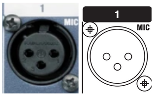

#### ⚠ WARNING
**SUPPLYING 48V PHANTOM POWER TO THE WIRELESS MIC RECEIVER CAN DESTROY THE INTERNALS OF BOTH THE RECEIVER AND MIXER. NEVER APPLY 48V PHANTOM POWER.**

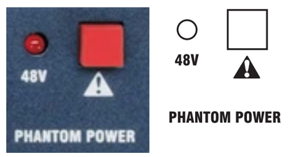

**This is the 48V Phantom Power Switch. Confirm that the 48V indicator is off before connecting equipment. Additionally, confirm the mixer and other equipment is OFF before proceeding.**

**PHANTOM POWER WILL DAMAGE EQUIPMENT IF USED IMPROPERLY.**


48V Phantom Power is a method of sending 48V DC through audio cabling (in this instance, XLR cables) to power a mic with electronics, such as condenser microphones. The system that this manual is being written on does not use any equipment that requires 48V Phantom Power.


#### Submixer

1. Set ALL faders to UNITY gain. (12 o'clock)
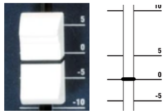
**Unity gain is the fader at 0 dB. 0 dB does NOT mean it’s muted. -∞ dB does.**
2. Set all EQ (Equalizer) knobs to UNITY gain.
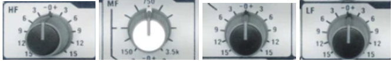
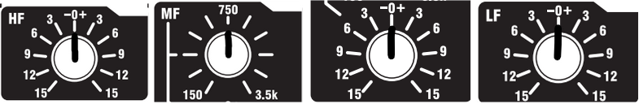
3. Unplug all input sources / cables.
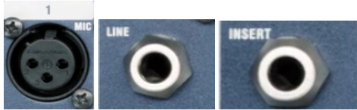
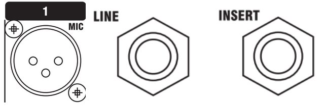
4. Set every channel’s gain to 0 or MINIMUM.
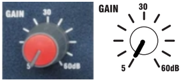
**You will adjust this later.**
5. Pan every channel to CENTER. Our system cannot pan.
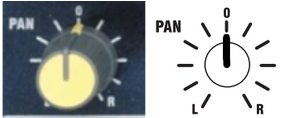
6. Set every channel’s aux volume / gain to 0 or MINIMUM.
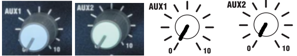
7. Mute every channel and disengage every channel’s PFL.
    The PFL button should be at its TOP position. You can test this by pressing the PFL button and seeing if it pops UP or latches DOWN. It must be at TOP for now.
    
    **We will unmute the channels later.**
8. Set all AUX Master settings to AUX1 Pre and AUX2 Pre.
    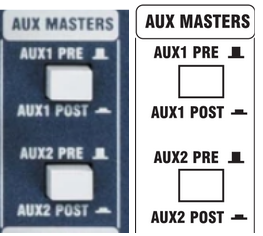
    **Just like PFL, it must be UP.**
9. Lower the MASTER Faders, both LEFT and RIGHT to 0 or MINIMUM -∞.
10. Set Stereo 2 fader to 0 or MINIMUM -∞.
11. Plug in your Computer Line Stereo and balance to FULL LEFT.
    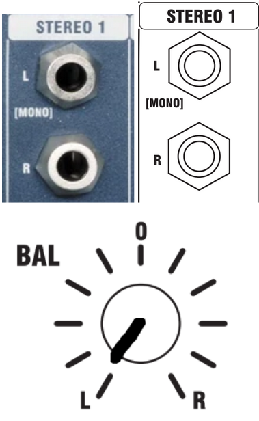

### ⚠ WARNING
**MISCONFIGURATION IS EXTREMELY LIKELY WHEN AN OPERATOR WITHOUT A FULL KNOWLEDGE OF THE SYSTEM IS ASSIGNED TO OPERATE OR MAINTAIN THE MASTER SETUP. MISCONFIGURATION MAY RESULT IN EQUIPMENT DAMAGE OR BODILY INJURY.**

**IF THERE IS NO OPERATOR CREDIBLE ENOUGH TO OPERATE THE MASTER SYSTEM, CONTACT THE WRITERS OF THIS MANUAL FOR SERVICE. SERVICE WILL BE DONE AT NO COST. ANY SERVICE EXCEEDING SUBMIXER CONNECTION TO THE SYSTEM SHALL BE DONE BY A QUALIFIED TECHNICIAN OR THE WRITERS OF THIS DOCUMENT. THIS DOCUMENT WILL ONLY CONTAIN THE INSTRUCTIONS TO CONNECT THE SUBMIXER TO THE MASTER SYSTEM AS IT IS THE ONLY OPERATION WITH THE MASTER SYSTEM THAT AN OPERATOR NOT FULLY KNOWLEDGABLE CAN DO.**

### Master System
1. Turn off switching supply.  
2. Unplug master strip plug from the receptacle.  
3. Confirm audio rack is fully deenergized with a non-contact voltage tester.  
   1. However, treat all audio system internals as energized as components such as capacitors may be energized, even when master power is disconnected.  
4. Open up the back panel.  
5. Find the Rane AM2 Mixer.  
6. Find the Channel 8 connector on the AM2 Mixer.  
7. Set Channel 7 and 8 Group Mode to “MIC \+0V”.  
8. Set All Channel Input Levels to MID, HALF, or 12 o’clock.
9. Find a XLR\*F100 cable and plug it into the MIX-L out on the submixer.  
   1. MIX-R will not be used.
   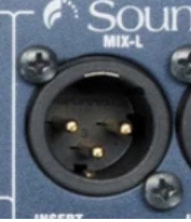
10. Route XLR cable through cable hole on the bottom left of the backside of the rack.  
11. Connect the male end of the XLR cable into the XLR to 3.5mm Mini EuroBlock adapter.  
12. Connect the 3.5mm Mini EuroBlock connector into the Rane HAL2’s Analog In Channel 8 EuroBlock port/  
13. Close back panel.  
14. Re-connect master strip to wall receptacle.  
15. Turn on switching supply. 

## Computer Input
1. Find the cable labeled SFX\*M6.  
2. Find the smaller side (3.5mm) TRS plug and plug it into the computer audio out.  
3. Set the computer audio output to “External Headphones”.  
4. Get the two large male TS plugs (¼”) and plug the red (RING) into STEREO 1 RIGHT, and the black (TIP) to STEREO 1 LEFT.
    
5. Set the computer volume to 90% or FULL. Do not touch it for volume control.

## General Ops Checklist
### Pre-Start
All equalizers - Centered
All cable connections - Flush and snug (Connected well)

Gain: 0 (MAX LEFT)  
All Faders: \-∞ dB  
All Channels: Muted  
All Channels PFL: Off  
All Channels Pan: Center  
Stereo 1 Balance: FULL LEFT  
Aux Masters: AUX 1 PRE, AUX 2 PRE  
Master Fader Left: \-∞ dB  
Master Fader Right: \-∞ dB  
All Channels: Muted  
Phantom Power 48V: OFF

### Submixer Start
Submixer Master Power - On  
Peak Meter - Monitor for Peaking

### Mic Gain Tuning
**NOTE: Every single performer will have a different gain setting. Therefore, use the same channel / receiver / mic for the same performer every single run.**

**PER CHANNEL:**  
Channel Fader: -∞ dB  
Channel PFL: ON  
Performer for tuning: Speak CLEARLY and LOUDLY.
Channel Gain: Slowly Raise  
	Stop Raising Gain When the Meter (Peaking Display) hits the Yellow bars.  
	Red bars indicate peaking.  
Channel PFL: OFF (This is important!)  


The audio that comes into a channel input in a mixer goes through multiple steps / paths until it reaches the master output.

Here is the path:  
Input → Gain → EQ → PFL Button → MUTE Switch → Fader → Master Output.

PFL allows you to view the volume of each channel ***without*** the audience hearing anything, if you have the channel muted and faders to \-∞ dB, as you are bypassing the last three steps (MUTE, Fader, and Main Output).

With the PFL on for a specific channel (*for this example, Channel 1*):  
Input 1 → Gain → EQ → PFL Button → Monitor Out.

However, just because you have the PFL on doesn’t mean the other operations are affected. If you have the channel faded up and mute off, the audience (or the master out) will have the audio from the channel as well.

Essentially, PFL allows you to view (and listen to) individual channels separate from the master out. If you have a headphone connected to the PHONE output jack, you will be able to hear the PFL isolated channel as well. PFL **will** “hijack” all other signals to the Monitor when it is on.


### Ready State
Submixer Master Power: OFF  
All Microphone Receivers: ON  
All Sources: ON  
Submixer Master Power: ON  
Master Audio Rack Master Power: ON  
	*Wait for master mixer, multiprocessor, and amp startup.*  
Confirm Switching Supply Power Status: ON and STABLE  
	*SEQUENCE: ON*  
	*1, 2, 3, 4: ACTIVATED*  
	*SURGE & GROUND SUPPRESSION: ON & FULL*  
Master Faders: UNITY / 0 dB  
All Channel Faders: \-∞ dB  
All Mutes: ON

### Performance 
Specific Mic Channel Fader: GRADUALLY Raise to UNITY / 0 dB  
Specific Mic Channel Mute: OFF  
Master Fader LEFT: GRADUALLY Raise to UNITY / 0 dB

*Adjust Channel Fader As Required*

If required, you may adjust the gain. **Only change the gain after you’ve pushed the channel fader to its maximums and it’s still not peaking.**

**Changing the master fader is dangerous. Only adjust it during performances if you know every single channel won’t peak.**

## Things To Keep In Mind
There are quite a few things to keep in mind when running sound, for both the system operator and the performers.

**OPERATORS:**

* Red On Meter \= Too Loud. Red means peaking.  
* Trust The Meter\! Just because it’s quiet for YOU doesn’t mean it’s quiet for THEM.   
* If you see a RED LED next to the master faders blinking or solid, check it out. If it’s the PFLs, it makes the monitors and the meter “lie” to you by only showing you that specific PFL channel.  
  * If PFL’s on, find it and turn it off.  
* Don’t chase the gain, chase the fader first. **ONLY** adjust the gain during performances when you have the fader at maximum and it’s still not going into the orange in the meter.  
* Keep the receivers line-of-sight. The mics run at 2.4 GHz frequencies (12.5cm band) and those frequencies are limited to line-of-sight (or *almost* line-of-sight)  
* Turn on your equipment in the order of *Sources (Mic Receivers, Computers), Mixer, and Master Rack*. Turn it off in the inverse order. **Not doing so may cause equipment damage.**  
* **Always, always, always** remove the batteries from the mic packs and put them in the charger. **Not doing so may drain the batteries and possibly cause battery leaking (which may cause equipment damage).**  
* If there is a ***really*** weird sound coming out (i.e. something loud, such as static or feedback), find out what it is and turn the fader completely off. If you still can’t find it, turn the master fader off and figure it out from there. 

**PERFORMERS:**

* Do **NOT** bend the mics aggressively. The mics are surprisingly fragile and **they can break**. They are **very expensive.** ($150+ *per* mic)  
* Keep the mic around one finger-width next to your mouth.  
* Clip your mic cable onto your shirt.  
* Assume EVERYTHING you say can be heard by EVERYONE. Don’t say anything you don’t want to scream at the whole school.

## Handling the Unexpected
Throughout the usage of the sound system, various parts and components may fail. This section will cover most problems. Follow the checklist in its listed order:

**Speaker Level Imbalance**  
Check the Rane DR2 / Rane DR3 in the Event Center and check all Zone Volumes are equal. The Controllers are in the Event Center near the door next to the backstage door. It is also labeled as **SOUND SYSTEM DO NOT TOUCH.** 

**No master sound**  
Check if the main system power is off.  
Check if the mixer power is off.  
Check if the master fader is at \-∞ dB.  
Check input gain is set correctly for all channels (See *Mic Gain Tuning)*  
Try a known, working cable.

**No Sound From Individual Mic**  
Check Mic Receiver is Connected and Powered to the Pack.  
Check Mic Receiver Volume is at MID / 50% / facing 12 o’clock.  
Check Mixer Channel Fader is not at \-∞ dB.  
Check input gain is set correctly (See *Mic Gain Tuning)*  
Try a known, working cable.

**Checking Cables**  
Confirm your XLR cables have continuity; check 1-1, 2-2, and 3-3. The connectors will be labeled with very small text on the connector.
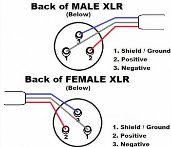
Confirm your XLR cables’ resistance is low, preferably under 100 Ohms.

**HAL2 Doesn’t Process Sound**  
Download the Rane Halogen software onto a compatible Windows computer, connect it to the HAL2 via Ethernet, and troubleshoot using the included meters.