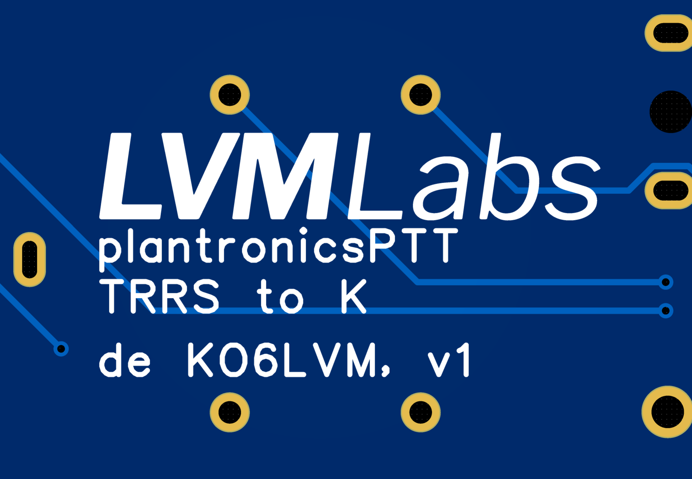


PTT Adapter for Baofeng radios with Plantronics QD headsets. 


<!--more-->


 See on Github



 CC0 1.0 Universal



 Hardware





  This project is not yet complete. Parts such as the build logs may be incomplete.


