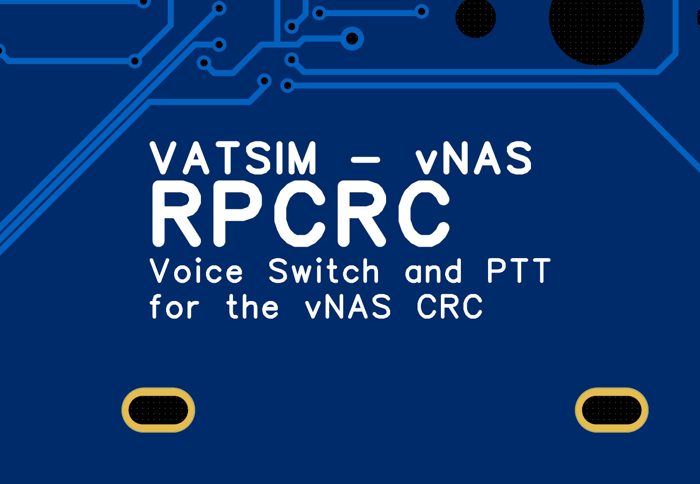


Press-To-Talk (PTT) for VATSIM's Consolidated Radar Client.


<!--more-->


 See on Github



 CC0 1.0 Universal





  This project is not yet complete. Parts such as the build logs may be incomplete.


## Features
* 3 Dedicated MX Switches for PTT and Deafen Toggles
* 4 Dedicated On-Off Switches for RX, SPKR, XC, and XCA Toggles in CRC
(INOP of 4/2026 due to CRC AFV Restrictions)
* 3 Green, Blue, and Red LEDs for PTT and Deafen
* Custom Board with RP2040
* Custom KMK Firmware for ARM Cortex-M0+ on CircuitPython