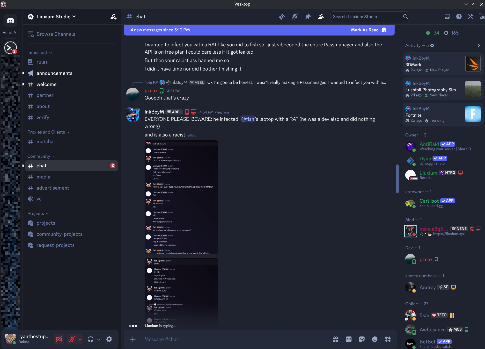
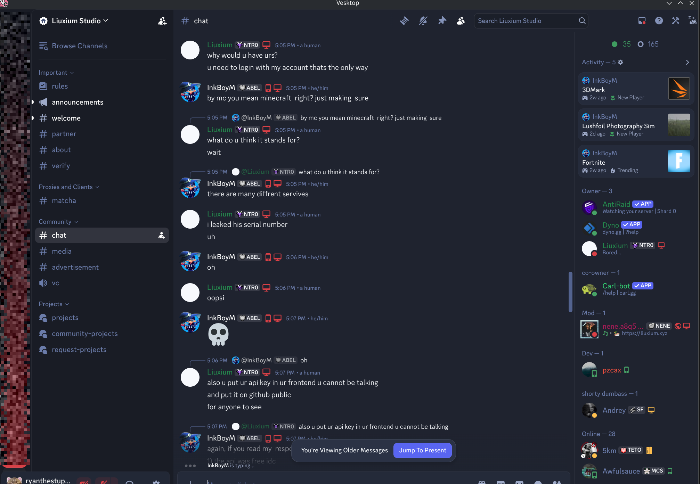
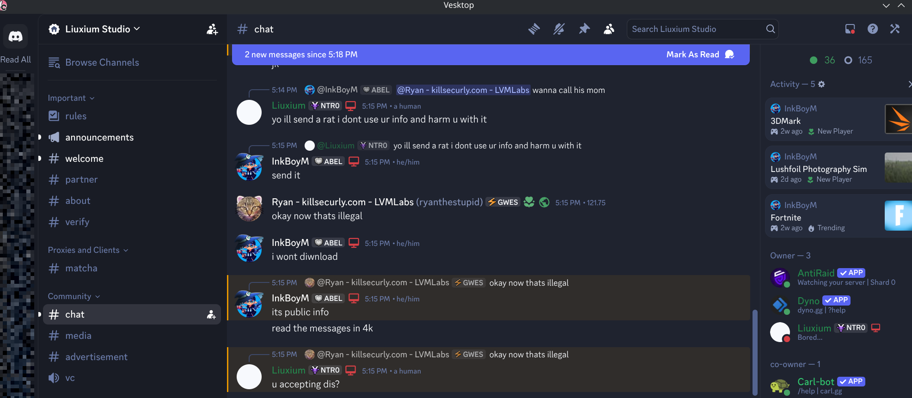
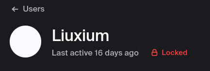


 18 USC § 873



 18 USC § 1030



 ToS



 11 May 2026


Liuxium was banned on May 11, 2026 for blackmail and fraud.

| Case Number |
| :---- |
| #0054 |

## Authorization
| Authorized By |
| :---- |
| KSF ATM - Administrator |
| KSF OPM1 - Ops Manager |

## Involved Users
| Users | Website |
| :---- | :---- |
| KSF ATM |  KSF CI (LVMLabs)  |
| KSF OPM1 |  KSF CI (LVMLabs)  |
| Liuxium |   EXTERNAL LINK |

## Regulations
| Violated Regulations | Code |
| :---- | :---- |
| Blackmail | 18 USC § 873 |
| Electronic Fraud | 18 USC § 1030 (CFAA) |
| All Above | KSF ToS |

## Timeline
| Occured At | Time |
| :---- | :---- |
| KSF Discord | 5/11/26 |
| Liuxium Discord | 5/11/26 |
| DMs | 5/11/26 |

| Event | Time | Users | Location |
| :---- | :---- | :---- | :---- |
| KSF OPM1 Requests Ban | 5:01 PM | KSF ATM, OPM1 | DMs |
| KSF OPM1 Sends Proof Batch 1 | 5:01 PM | KSF ATM, OPM1 | DMs |
| KSF ATM Starts Investigation | 5:08 PM | KSF ATM | Liuxium Discord |
| Proof Batch 2 shown by Liuxium Records | 5:15 PM | KSF ATM, OPM1, Liuxium | Liuxium Discord |
| KSF OPM1 Banned by Liuxium | 5:20 PM | KSF OPM1, Liuxium | Liuxium Discord |
| Investigation Closed | 5:38 PM | KSF ATM | KSF Discord, DMs |

## Proof

